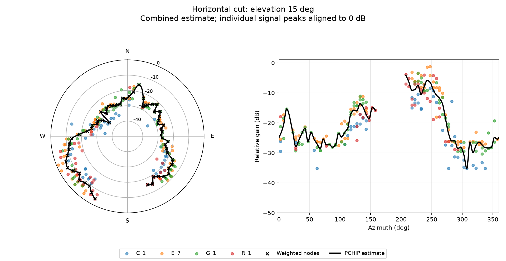
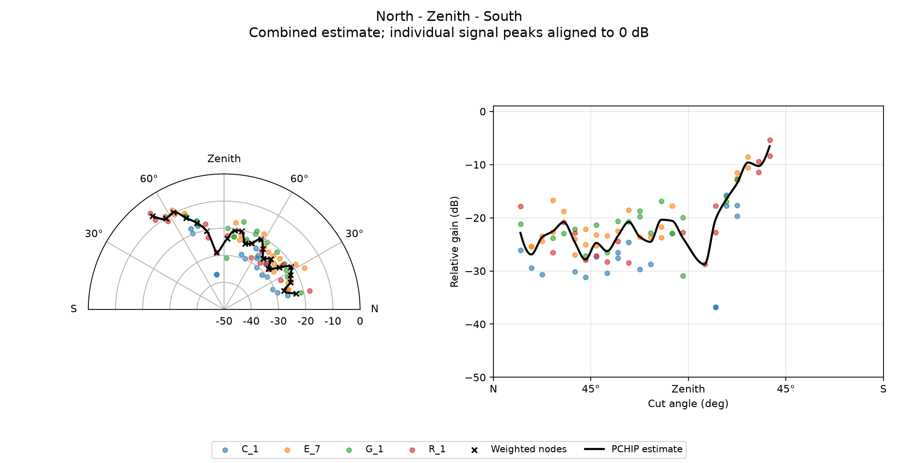
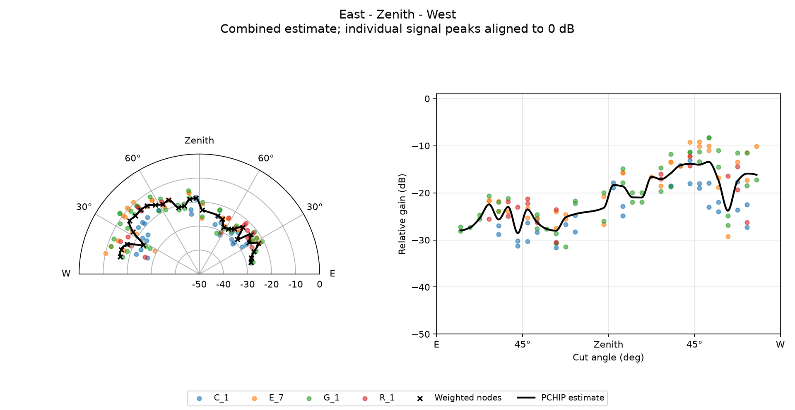
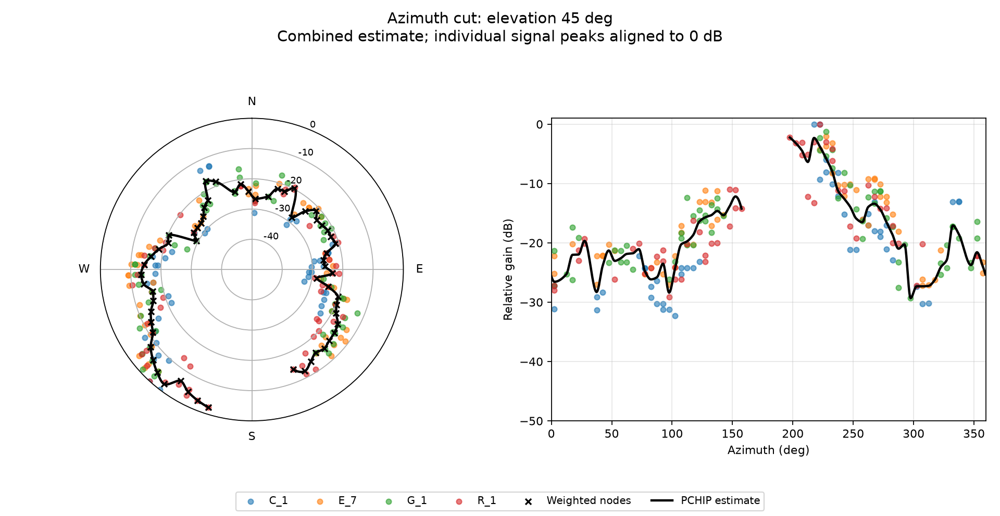
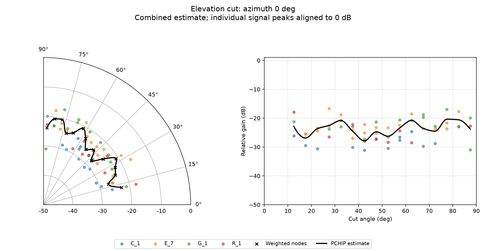
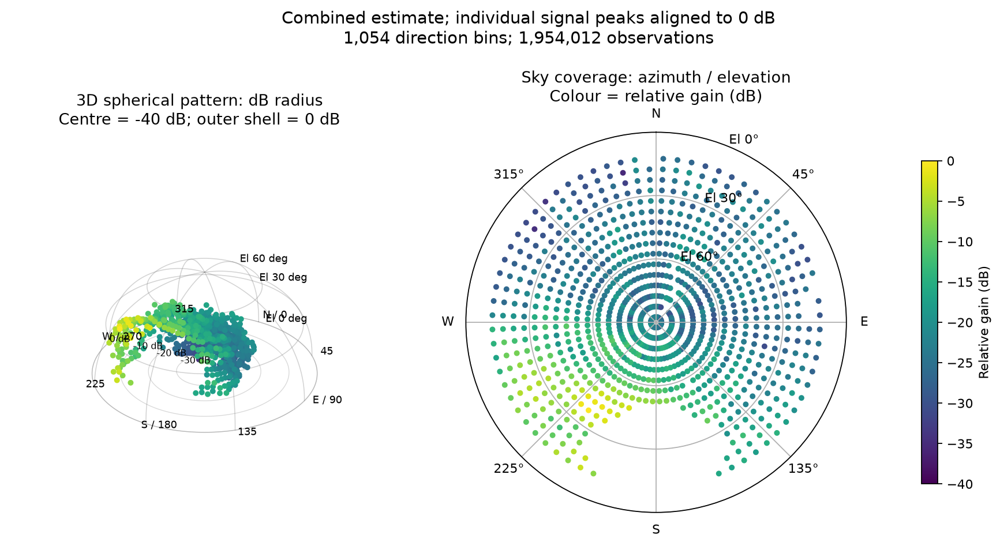

# gnss-antenna-pattern

通常の NMEA ログから、設置状態の GNSS 受信パターンを推定します。RAWX や RINEX 観測ファイルは不要です。

[English](README.md)

NMEA の GNSS C/N0 と RINEX 航法データから、受信系の**相対アンテナパターン**を衛星系・信号別に推定します。
GPS・Galileo・GLONASS・BeiDou・QZSS を既定ですべて対象にします。

## 実行

Python 3.10 以降を使用します。

```bash
python3 -m venv .venv
source .venv/bin/activate
pip install -r requirements.txt
python gnss_antenna_pattern.py \
  --nmea receiver.nmea \
  --reference-cn0 45 --gps-utc-offset 18 --output output
```

45 dB-Hz は仮定値です。基準距離（既定 20,200 km）で想定する C/N0 を指定してください。
標準大気のガス減衰を既定で適用します。基準 C/N0 は**ガス減衰を含まない値**を指定してください。
GPS − UTC は観測日に対応する秒数を指定します。18 秒は 2024 年のデータの例です。
実際の観測ファイルは同梱していません。

計算中は進捗バーに割合・処理件数・経過時間・推定残り時間（ETA）を表示します。
件数には仰角マスクなどで除外したサンプルも含みます。100% はサンプル計算の完了を示し、その後に集計・CSV保存・グラフ描画を行います。
読み込み・描画などの処理段階も表示します。進捗表示は標準エラー出力に出し、端末では同じ行を更新、ログへのリダイレクト時は約10秒間隔で出力します。
`--no-progress` で進捗バーと段階表示を無効化できます（取得メッセージ・警告・最終結果は表示します）。追加ライブラリは不要です。

### PyGPSClient の分割ログ

PyGPSClient で取得した NMEA ログが分割されている場合、`--nmea` の後に古い順で複数ファイルを指定できます。`--nmea` の繰り返し指定も可能です。従来の単一ファイル指定も使えます。

```bash
python gnss_antenna_pattern.py \
  --nmea logs/part001.log logs/part002.log logs/part003.log \
  --reference-cn0 45 --gps-utc-offset 18 --output output

# オプションを繰り返して指定する場合:
python gnss_antenna_pattern.py \
  --nmea logs/part001.log --nmea logs/part002.log logs/part003.log \
  --reference-cn0 45 --gps-utc-offset 18 --output output
```

中間の結合ファイルを作らず、元ファイルを変更せずに、一続きの NMEA 文として処理します。日時・位置・高さ・日付またぎの状態を分割境界で引き継ぐため、次のファイルが GSV から始まっても処理できます。ファイル間で `(UTC時刻, 衛星, 信号ID)` が重複する観測は最初の値を採用します。通常のテキストと `.gz` を混在でき、通常のテキストは `.log`、`.nmea` などの拡張子で使用できます。

同じ受信機・同じ固定アンテナ条件で連続取得した分割ログを、取得順に指定してください。内容による自動並べ替えは行いません。シェルのワイルドカードも、展開順が取得順になる場合は利用できます。分割境界は完全な NMEA 文の間にあることを前提とします。別セッションの GSV の前には、そのセッションの有効な日時・位置が必要です。前セッションの位置に依存させないでください。BKG の自動取得は全入力ファイルの UTC 観測日を対象にします。`metadata.json` の `arguments.nmea` に処理順の入力ファイル一覧を記録します。

### BKG BRDC の自動取得

`--nav` を省略すると、NMEA の UTC 観測日から BKG のリアルタイム由来 BRDC を HTTPS で自動取得します。
複数日のログでは各観測日とその前日を取得して結合します。前日分は日付境界の軌道計算用です。
取得元は `https://igs.bkg.bund.de/root_ftp/IGS/BRDC/YYYY/DDD/BRDC00WRD_S_YYYYDDD0000_01D_MN.rnx.gz` です。
BKG の更新済み RINEX を実行時に取得する方式で、NTRIP の常時接続や自動再解析は行いません。

- 保存先は `.cache/brdc`。`--nav-cache PATH` で変更できます。
- 当日・前日分は再実行時に再取得します。過去分は、対象日の翌々日 UTC 以降に取得したキャッシュを再利用します。それ以前の部分的なキャッシュは再取得します。
- `--refresh-nav` で過去分も強制更新できます。取得したファイルは読み込み検証後にキャッシュに置き換えます。
- 観測日分が未公開、通信失敗、ファイル不正の場合は理由を表示して終了します。補助的な前日分の 404 だけは通知して続行します。
- ローカルファイルを使う場合は従来どおり `--nav broadcast.nav` を指定します。この場合、ネットワークアクセスはありません。
- `metadata.json` の `nav_sources` に取得 URL、ファイル、キャッシュ利用の有無を記録します。

配信状況により最新の観測をカバーできない場合は、時間を置いて再実行してください。
参照: [BKG HTTPS アクセス](https://igs.bkg.bund.de/access)、[BKG BRDC 配信例](https://igs.bkg.bund.de/root_ftp/IGS/BRDC/2025/003/)。

## 入力

NMEA ログに非 ASCII バイトが混入していても処理を継続します。該当行全体を読み飛ばし、メタデータの `skipped.non_ascii_line` に件数を記録します。数値が変わらないよう、測定値の途中のバイトだけを削除する処理は行いません。読み飛ばし後の GSV は、古い時刻・位置を使わないよう、新しい有効な RMC/GGA が現れるまで除外します。`.gz` でも同様です。RINEX は従来どおり厳密に読み込みます。

- 日付・時刻・有効位置を含む RMC と、下表の GSV が必要です。GSV の SNR が C/N0（dB-Hz）であることを受信機仕様で確認してください。
- GSV は直前の有効 RMC/GGA の時刻・位置に対応付けます。最初に RMC が必要です。長い通信停止や文の並べ替えがあるログは時刻対応を事前確認してください。
- GGA があれば標高＋ジオイド高を楕円体高に使います。それまでは `--height-m`（既定 0 m）です。
- チェックサム付き文は検証します。複数信号 ID は別グループとして処理します。`--signal-id 1` などで対象を絞れます。旧形式の ID なし GSV も対応します。衛星系の曖昧な GNGSV、SBAS、NavIC は対象外です。
- RINEX 2.x GPS NAV / 3.x NAV（混合も可）を使用します。観測ファイルや RINEX 4 は未対応。入力は `.gz` にも対応します。
- アンテナは固定姿勢を想定します。θ は天頂から、φ は真北から東回り。傾斜や姿勢変化の補正は含みません。

### 衛星系・信号の選択

| 衛星系 | 記号 | 対応 GSV と衛星番号 | 軌道処理 |
| --- | --- | --- | --- |
| GPS | G | GP、1～32 | 放送ケプラー軌道 |
| Galileo | E | GA、1～36／301～336 | Galileo の重力定数を使用 |
| GLONASS | R | GL、1～32／65～96 | 位置・速度・加速度を使った RK4 数値積分 |
| BeiDou | C | GB・BD、1～63／101～163／201～263 | MEO・IGSO と GEO の軌道変換を区別 |
| QZSS | J | GQ・QZ、1～10／193～202、GP の193～202 | GPS と同形の放送軌道 |

```bash
# Galileo と BeiDou を選択
python gnss_antenna_pattern.py --nmea receiver.nmea \
  --reference-cn0 45 --gps-utc-offset 18 --constellations E,C

# GPS L1 だけを選択
python gnss_antenna_pattern.py --nmea receiver.nmea \
  --reference-cn0 45 --gps-utc-offset 18 --constellations G --signal-id 1
```

周波数は衛星系と NMEA 4.11 の信号 ID から推定します。例: G:1=1575.42、E:7=1575.42、C:1=1561.098、J:1=1575.42 MHz。
GLONASS L1/L2 は航法データの周波数チャンネル k を使い、1602+0.5625k／1246+0.4375k MHz とします。
ID なしの旧形式は GPS/QZSS=L1、Galileo=E1、BeiDou=B1I、GLONASS=L1 を仮定し、メタデータに記録します。
NMEA 4.10 やメーカー独自の信号 ID は定義が異なる場合があります。機器仕様に合わせて `--signal-frequency C:3=1207.14` のように上書きしてください。
このオプションは複数指定できます。ID なしの場合は `G:legacy=1575.42` の形式です。不明・全信号指定（ID 0）の周波数を無条件には推定しません。

Galileo は E1・E5a・E5b の各健康フラグと I/NAV／F/NAV のデータソースを確認します。
E5a+b と E6 は、この RINEX 3 の単一レコードから必要な健康状態を確定できないため解析対象外です。
GLONASS CDMA 信号は未対応です。すべての衛星系について、利用可能な航法データ・対応信号・正常な健康状態のそろったサンプルを処理します。
除外件数は `metadata.json` の `skipped` にグループ別で記録します。

各信号の基準 C/N0 は `--reference-cn0` を共通の初期値とし、`--signal-reference-cn0 C:1=44` のように個別指定できます。
信号別のパターンは各グループ内で最大0 dBに正規化します。さらに、後述の `combined/` に合成した参考パターンを出力します。

時刻は GPS/QZSS/Galileo を GPST と同一とする近似、BeiDou を GPST−14秒、GLONASS RINEX を UTC として扱います。
GST/GPST などの微小な時刻差と各 ECEF 座標系間の精密変換は含めません。これはアンテナパターン用で、精密測位用の実装ではありません。
GLONASS は J2・地球回転・放送外力を含め、最大60秒刻みで積分します。放送の km 単位は m に変換します。
BeiDou GEO は半長軸40,000 km超かつ放送軌道傾斜角の絶対値0.3 rad未満で識別し、5°傾斜した座標系の変換を適用します。

## モデルと制約

### 標準大気によるガス減衰（既定で有効）

ITU-Rpy 0.4.0 の **ITU-R P.676-12** 吸収線モデルと **P.835-6** 標準大気を使用します。
P.676 の最新版を実装したものではなく、利用する勧告版を固定しています。
海面で気温 288.15 K、全気圧 1013.25 hPa、水蒸気密度 7.5 g/m³、水蒸気のスケールハイト 2 km を仮定します。
各層の全気圧から水蒸気分圧を引いた乾燥空気圧を吸収計算に渡します。
指定した観測点標高から高度 100 km まで最大 50 m 幅の球殻に分け、各層の乾燥空気・水蒸気吸収率を経路長で積算します。
地球半径は 6371 km、経路は直線とし、屈折による曲がりは含めません。適用仰角は 5° 以上です。

```bash
python gnss_antenna_pattern.py --nmea receiver.nmea \
  --reference-cn0 45 --gps-utc-offset 18 \
  --atmosphere-height-m 100
```

- `--frequency-mhz`: 単一の衛星系・信号を選択した場合の周波数上書き（MHz）。既定は信号 ID から自動推定します。複数グループは `--signal-frequency` を使用します。対応範囲は1000～2000 MHzです。
- `--atmosphere-height-m`: 大気計算用の固定標高（平均海面基準、0～10000 m）。既定は海面 0 m。NMEA の楕円体高や `--height-m` とは別です。実際の観測点標高を指定してください。
- `--gas-model none`: ガス減衰を無効化して従来の計算に戻します。
- `samples.csv` に補正前の `vacuum_model_cn0_dbhz`、乾燥空気の `gas_dry_attenuation_db`、水蒸気の `gas_water_vapour_attenuation_db`、合計 `gas_attenuation_db` を出力します。
- `metadata.json` の `gas_models` に周波数別のモデル版、大気条件、積分条件を記録します。

これは標準大気での推定であり、観測日の気象条件の再現ではありません。
降雨・雲・シンチレーション、大気放射によるアンテナ雑音温度の変化は含めず、雑音密度一定として信号電力の減衰だけを C/N0 に反映します。
参考: [ITU-Rpy P.676](https://itu-rpy.readthedocs.io/en/latest/apidoc/itu676.html)、[ITU-Rpy P.835](https://itu-rpy.readthedocs.io/en/latest/apidoc/itu835.html)。

この実装での海面・GPS L1 の減衰量は、天頂で約 0.034 dB、仰角 30° で約 0.068 dB、10° で約 0.192 dB です。
検証では独立した適応積分との比較、層厚を半分にした収束確認、L1/L2/L5、補正の有効・無効時の CSV を確認します。

```text
model_cn0 = reference_cn0 - 20 log10(range / reference_range) - gas_attenuation_db
gain_residual_db = measured_cn0 - model_cn0
relative_gain_db = 方向ビンの残差中央値 − 同じ衛星系・信号内の全ビンの最大中央値
```

放送軌道から衛星位置を求め、信号伝搬時間と地球回転を補正して距離・方位・仰角を計算します。
RINEX NAV は実際の送信強度や受信系雑音を含まないため、入力だけでは絶対利得 dBi を求められません。
結果には衛星間の送信強度差、送信アンテナ特性、受信機・ケーブル特性、偏波損失、大気、遮蔽物、マルチパスも含まれます。
絶対校正には既知の基準アンテナ／受信系などが必要です。一定の基準 C/N0 の変更は正規化後の相対パターンに影響しません。

健康フラグが正常で toe から `--max-ephemeris-age`（既定 7,200 秒）以内の最も近い軌道を使用します。
GLONASS はこの設定にかかわらず最大1,800秒に制限します。古いローカル BRDC で除外される場合は、`--nav` を省略して更新版を取得してください。
この判定は各放送暦の fit interval を個別に解釈するものではありません。
仰角 `--min-elevation`（既定 10°）未満を除外します。未観測方向は欠測であり、低利得とは断定できません。

## 出力

### 出力例

以下は GPS（`G_1`）・Galileo（`E_7`）・GLONASS（`R_1`）・BeiDou（`C_1`）を合成した参考推定です。カット図の色付き点は信号グループ別の方向ビン、黒い×印は観測数で重み付けした合成点、黒い曲線は PCHIP 補間を示します。各入力グループのピークをそれぞれ0 dBに揃えており、絶対利得を校正した図ではなく、受信系の相対的な応答を示す例です。曲線が途切れている部分は、補間に必要な隣接観測点が不足しています。

**仰角15°の水平カット。** 左の極座標図は方位に沿ったパターン、右の直交座標図は方位角に対する相対利得を示します。



**南北方向の垂直カット。** 北から天頂を通って南に至る、上半球の両側を表示します。



**東西方向の垂直カット。** 東から天頂を通って西に至る垂直面を表示します。



**仰角45°の追加アジマスカット。** 角度を変更できるアジマスカットについて、既定の固定仰角で出力した例です。



**方位角0°の追加エレベーションカット。** 真北方向での仰角に対する応答を示します。



**合成3次元パターン。** 左は球面グリッド上に方位角・仰角・dB 目盛りの半径を示す3次元図です。右は天頂を中心とする上空の極座標マップで、色が相対利得を表します。観測点の散布図であり、未観測方向を補間曲面で埋めるものではありません。



### コンステレーションを合成した補間カット

既定で `output/combined/` に、全衛星系・信号の点を合成した **仰角15°の水平カット・南北垂直カット・東西垂直カット** と、任意アジマス／エレベーションカットを出力します。
図は極座標と直交座標の2パネルです。信号グループ別の色付き点、重み付き合成点、黒い PCHIP 曲線を表示します。

- 各信号グループの既存の最大0 dB正規化を使って高さを揃えます。重複領域から送信強度オフセットを推定する校正処理ではありません。
- カット内の全グループの方向ビンを使用し、同じ描画角のビン中央値をサンプル数で重み付けして **dB値の平均** を求めます。生の全観測値の中央値や電力平均とは異なります。
- 合成点を PCHIP（形状を保つ区分3次エルミート補間）で結びます。各区間の端点範囲を超えるオーバーシュートを避けますが、統計的な平滑化や物理モデルへのフィッティングではありません。
- 既定では30°を超える点間の空白は結びません。`--combined-max-gap 60` などで変更できます。方位角の0°/360°境界も扱います。
- 観測範囲外は外挿しません。連続する点が足りない部分は点だけを表示し、欠測部分を強制的に閉じた形にはしません。
- `--no-combined` で合成図の生成を無効化できます。既存の衛星系・信号別の図はそのまま出力します。

異なる周波数・送信強度・観測範囲に由来する差が残るため、合成図は **見た目と傾向を確認する参考推定** です。
特に各グループのピークを観測できていない場合、相対オフセットが残ります。補間点は新たな実測点や実測カバー率の増加とは扱いません。

各カットについて次を保存します（例: `horizontal_pattern`）。

| ファイル | 内容 |
| --- | --- |
| `horizontal_pattern.png` | 元の点と合成曲線の極座標・直交座標図 |
| `horizontal_pattern_points.csv` | 合成元の信号別方向ビン、サンプル数、角度、相対利得 |
| `horizontal_pattern_nodes.csv` | 同角度の重み付き合成値、総サンプル数、元グループ、ビン間ばらつき |
| `horizontal_pattern_curve.csv` | 約0.5°刻みの補間値。`segment_id` が違う区間は結ばない |
| `metadata.json` | 正規化・重み付け・補間の条件と各カットの点数 |

方位角の補間CSVでは `plane_angle_deg` は0～360°未満、`unwrapped_angle_deg` は境界を連続に表した角度です。
`between_bin_std_db` は合成元ビン中央値間のばらつきで、利得推定の信頼区間ではありません。

既存の `pattern.csv` から、軌道・ガス減衰を再計算せずに合成図だけを作れます。

```bash
python combined_patterns.py \
  --pattern-csv output/multignss_validation/pattern.csv \
  --output output/multignss_validation/combined \
  --max-gap 30
```

この再描画コマンドにも `--cut-width`、`--azimuth-cut`、`--elevation-cut` を指定できます。省略すると既定値（10°、0°、45°）を使うため、元の解析で変更した場合は同じ値を指定してください。
参考: [SciPy PchipInterpolator](https://docs.scipy.org/doc/scipy/reference/generated/scipy.interpolate.PchipInterpolator.html)。

### 全衛星系と合成データの3次元パターン

採用された各衛星系・信号グループで `pattern_3d.png` を生成します。GPS だけでなく Galileo・GLONASS・BeiDou・QZSS も対象です。複数グループの場合は、例えば `output/E_7/pattern_3d.png` のように各フォルダへ保存し、単一グループの場合は出力先直下へ保存します。タイトルに衛星系と信号名を表示します。

既定の合成出力では `combined/pattern_3d.png` と `combined/pattern_3d.csv` も生成します。カットの角度・幅に関係なく、観測された全方向ビンを使用します。方位角と仰角の**両方**が同じビンを、観測数で重み付けして dB 値で平均します。各グループの既存の最大0 dB基準を保持し、合成後の最大値を再正規化しません。CSV には角度・相対利得・件数・寄与グループ・ビン間ばらつきを、メタデータには3次元合成条件を記録します。

既定の `pattern_3d.png` は、3次元球面極座標図と上空の極座標マップを併記します。方位角は真北から東回り、仰角は水平から天頂へ測ります。3次元の表示半径は `(gain_dB - floor_dB) / (0 - floor_dB)` で、下限は最小利得より低い10 dB刻みの値（最大でも −30 dB）に設定します。これは表示用の dB 目盛りで、電力比ではありません。上空マップの半径は天頂角（`90 - 仰角`）、色は利得なので、低利得方向も確認できます。図には描画ビン数と元の観測数を表示します。

全ビンを間引かずに描画します。生の観測は方向ビンに集計済みで、合成ではさらに衛星系・信号間で方位角と仰角が一致するビンを統合します。従来の `10**(gain_dB/10)` 半径では、−20 dB が0.01、−30 dB が0.001となり、多くの点が原点付近で重なっていました。この電力比表示は `pattern_3d_linear.png` に残します。合成メタデータの `pattern_3d.rendering` に描画点数 `plotted_bins`、dB下限、間引きなしの情報を記録します。観測ビンの散布図であり、未観測方向を補間して曲面にはしません。合成図には前述の周波数差・グループ間オフセットの制約が残ります。`--no-combined` は合成カットと合成3次元図の両方を無効化します。既存の `pattern.csv` から `combined_patterns.py` を実行する場合も、合成3次元ファイルを再生成します。

### 信号別の出力

複数グループが採用された場合は `output/G_1/`、`output/E_7/`、`output/R_1/`、`output/C_1/`、`output/J_1/` などに以下の図・CSVを出力します。
ID なしは `G_legacy` などです。単一グループの場合は従来どおり出力先直下に保存します。
複数グループ時の直下の `samples.csv`／`pattern.csv` は `signal_group` 列付き一覧であり、グループ間の平均・結合利得を計算したものではありません。
メタデータの `groups` に各グループの出力先・周波数・サンプル数・ビン数があります。各フォルダの図には、そのグループの値だけが入ります。
同じ出力先の過去の別グループのファイルは削除しないため、実行条件を変える場合は新しい出力先の使用を推奨します。

| ファイル | 内容 |
| --- | --- |
| samples.csv | UTC、衛星系、衛星、信号 ID／グループ、周波数、基準 C/N0、位置、距離、方位・仰角、θ/φ、実測・モデル C/N0、差分 |
| pattern.csv | アジマス／エレベーションのビン中心（θ/φ も併記）、件数、残差中央値・標準偏差、最大 0 dB の相対利得 |
| horizontal_pattern.csv / horizontal_pattern.png | 水平カット：仰角15°付近での方位角パターン |
| vertical_ns_pattern.csv / vertical_ns_pattern.png | 南北垂直面：北→天頂→南の上半面 |
| vertical_ew_pattern.csv / vertical_ew_pattern.png | 東西垂直面：東→天頂→西の上半面 |
| azimuth_cut.csv / azimuth_cut.png | 仰角45°付近のアジマス（方位角）方向パターン |
| elevation_cut.csv / elevation_cut.png | 方位角0°付近のエレベーション（仰角）方向パターン |
| theta_cut.png | φ 一定付近での θ カット |
| phi_cut.png | θ 一定付近での φ カット |
| pattern_3d.png | dB半径の3次元極座標図と上空の極座標マップ、描画ビン数 |
| pattern_3d_linear.png | 従来の相対電力比を半径とする3次元散布図 |
| metadata.json | 実行条件、採用・除外件数、モデルと制約 |

`--bin-deg 5` は方向ビン幅（90°を割り切る値）。
既定で **仰角15°の水平カット・南北垂直面・東西垂直面** の CSV と極座標図を出力します。
南北面は方位角0°と180°、東西面は90°と270°の両側を同じ図に描きます。
CSV の `side` は N/S/E/W、`plane_angle_deg` は北または東の水平を0°、天頂を90°、南または西の水平を180°とした描画角です。
水平カットでは `side=horizontal`、`plane_angle_deg` は方位角です。各図で全パターン共通の最大0 dBを使用します。
方位角は真北0°から東回り、仰角は水平0°から天頂90°です。

**水平カットの観測範囲について:** 既定の `--cut-width 10` では仰角15°±5°（10～20°）にあるビン中心を選びます。
既定の仰角マスク10°・標準ガスモデルをそのまま使用できます。該当する観測がない場合は欠測表示・ヘッダーのみのCSVになります。
これは仰角15°付近の方位角カットで、仰角0°の水平面ではありません。`--cut-width` で選択する仰角範囲の幅を変更できます。

追加で従来の任意アジマス・エレベーションカットも出力します。以下のオプションはこの追加カットに適用され、水平・南北・東西の固定面は回転しません。
`--azimuth-cut 0 --elevation-cut 45 --cut-width 10` が既定のカット条件で、ビン中心が指定面の±5°以内の点を描きます。
`--azimuth-cut` はエレベーション図の固定方位、`--elevation-cut` はアジマス図の固定仰角を指定します。
例えば `--azimuth-cut 90 --elevation-cut 30` は東方向での仰角カットと、仰角30°での方位角カットを出力します。
各カットは2次元パターンのビンを選択したもので、もう一方の角度全域で平均する処理ではありません。正規化基準は両図とも全パターンの最大値です。
データのないカット CSV はヘッダーだけを出力します。
従来の θ/φ 図も出力します。`--phi-cut` は `--azimuth-cut` の別名、`--theta-cut` は `90 - 仰角` を指定する互換オプションです（`--elevation-cut` と同時指定不可）。
信号別の図では未観測領域を補間しません。該当点がないカットにはその旨を表示します。同名出力ファイルは上書きします。

## 検証

```bash
python3 -m unittest discover -s tests -v
```

合成データで5系統の衛星番号・時刻系・周波数、BeiDou GEO の座標変換、GLONASS の独立積分器との比較、衛星系・信号別の出力を検証します。
外部の精密軌道との測位精度レベルでの比較は別途必要です。
仕様参考: [IGS RINEX 3.05](https://files.igs.org/pub/data/format/rinex305.pdf)、[Trimble GSV](https://receiverhelp.trimble.com/alloy-gnss/en-us/NMEA-0183messages_GSV.html)。
信号 ID 参考: [DATAGNSS NMEA 4.11](https://docs.datagnss.com/common/common_protocol_nmea/)。
軌道計算参考: [ESA GNSS satellite coordinates](https://gssc.esa.int/navipedia/index.php/Computation_of_GNSS_Satellite_Coordinates)、[RTKLIB の放送軌道実装](https://github.com/tomojitakasu/RTKLIB/blob/master/src/ephemeris.c)。

## お問い合わせ

不具合報告・機能要望・使い方の質問は、[GitHub Issues](https://github.com/kh19440807/gnss-antenna-pattern/issues) へお願いします。

共同研究などのご相談や非公開のお問い合わせは、[alice.higuchi@trident-global.net](mailto:alice.higuchi@trident-global.net) へご連絡ください。

NMEA ログには受信位置が含まれます。公開の Issue に添付する前に位置情報を取り除くか、非公開での共有方法についてメールでご相談ください。

## ライセンス

本プロジェクトのコードと同梱ドキュメントは、[MIT License](LICENSE) で公開しています。著作権表示は Copyright (c) 2026 kh19440807 です。

著作権表示とライセンス文を保持する条件で、商用利用・改変・再配布が可能です。本ソフトウェアは無保証で提供します。全文は `LICENSE` を参照してください。第三者の依存ライブラリや外部データには、それぞれのライセンス・利用条件が適用されます。
